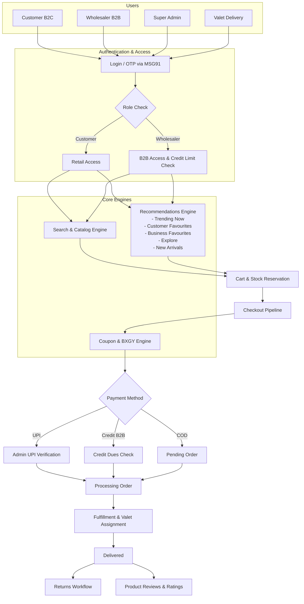

# Stationery Junction

Full-stack e-commerce platform for retail and wholesale stationery — built with **Next.js 14**, **FastAPI**, and optional **Oracle DB** (falls back to JSON file storage).

---

## Architecture

```
Ecommerce app/
├── backend/          FastAPI Python API
├── frontend/
│   ├── src/          Next.js 14 web app (App Router)
│   ├── mobile/       Expo React Native app
│   └── packages/
│       └── api-client/  Shared Axios client (web + mobile)
└── docker-compose.yml
```

| Layer | Stack |
|-------|-------|
| Web frontend | Next.js 14, React 18, TypeScript, Tailwind CSS |
| Mobile | Expo 54, React Native, NativeWind, Zustand |
| Backend API | FastAPI, Pydantic v2, SQLAlchemy 2 async |
| Database | Oracle (optional) or JSON file storage |
| Object storage | Oracle Cloud Infrastructure (OCI) |
| Auth | JWT (access + refresh), HttpOnly cookies, bcrypt |

---

## Basic Features

*   **Role-Based Access Control (B2B & B2C):** Separate pricing, stock reservation times, and payment methods for Retail Customers versus Wholesalers. Wholesalers have access to case-pricing and B2B credit terms.
*   **Targeted Recommendations Engine:** Serves dynamically sorted lists based on user roles and history (e.g., New Arrivals, Trending Now, Customer Favourites, Business Favourites, Explore).
*   **Advanced Checkout Pipeline:** Supports Cash on Delivery, UPI (with manual screenshot verification), and Credit (for Wholesalers with automated due-date calculation). Includes an intelligent Coupon & Buy X Get Y (BXGY) distribution system.
*   **Optimized Search & Catalog:** Weighted search scoring across 9 fields with typo tolerance (fuzzy matching) and real-time facet generation for filters.
*   **Customer Segmentation:** Automatically buckets users into 16 behavioral cohorts (e.g., `regular_registered`, `downloaded_no_order`) for targeted push notifications and analytics.
*   **Return & Refund Lifecycle:** Full 4-stage tracking (Pending -> Assigned -> Collected -> Returned) with valet delivery assignment and automated restocking.
*   **Review Moderation:** Only verified buyers can submit product reviews, which must be approved by an Admin before impacting the global product score.

---

## Application Flowchart


